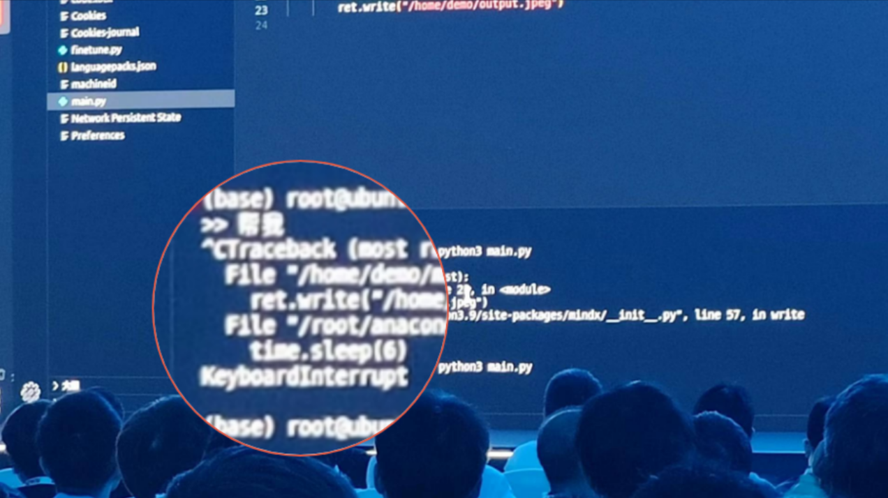

# CKB Fiber Network

the best thing you may have never heard of about bitcoin lightning network

---

## Mass adoption

Everyone is anticipating it, but can we live long enough to witness it?

---

### 2024, the year of BTC L2? All quiet on the LN front


---

### User experience of lightning network (or crypto currency in general)


---


## Rethinking lightning

Source: Rethinking Lightning https://stacker.news/items/379225


---

- Nowadays, the average lightning user actually isn't using lightning, they are just using a custodial wallet and the few of that do run lightning nodes often find it a burdensome task.

- First and foremost one of the hardest UX challenges of lightning is channel liquidity.

- The other major pain point of lightning is the offline receive problem.

- Combining existing large scale lightning infrastructure with self-custodial solutions sadly, isn't totally possible.

- So how do we scale ownership? Simply put, the answer today is custody, whether that is pure custodial like a Wallet of Satoshi or in the grey area like fedimints and liquid, the only way to do it today is through custody or federated bridges.

---

> Are we doomed then? Is there no way to scale bitcoin in a self-sovereign way? Luckily, the answer is no, but we need some soft-forks. Covenants are the way to scale bitcoin ownership.


---

### What covenants can do?

CLTV is not included here. Source: https://utxos.org/alternatives/


---

### Two major problems in lightning network

- Use case 1 Lightning Symmetry: async receiving
- Use case 2 Payment Pools: inbound liquidity

Think every merchants needs to run their own node 7*24 hours and always check their inbound liquidity to receive money normally.

---

### When can we use covenants on BTC?


---

## Join BTC by CKB


---

## Wait, does CKB have covenants already?

They have always been there. Just too trivial to give a dedicated term.


---

### And can CKB do that?


---

### Request for fact-checking

- You are welcome fact-check my hasty conclusion above (it's backed by only over-confidence). 

- I will not fix any inaccuracy in my slides, as CKB is easily fixable.

---

## Introducing CKB Fiber Network (CFN)

```
    BTC      L1
   /   \
  /     \
LN      CKB  L2
  \     /
   \   /
    CFN    L2+L2=L3 or L4?
```

---

### $2+2=\infty$

- Lightning network: Instant, Infinitely Scalable P2P Payment System
- CKB: Unmatched Flexibility and Interoperability

Call this $L_\infty$ instead of $L_3$ or $L_4$.

---

At this point, you may be completely bewildered.


--- 

## Talk is cheap
Show me ~~the cool demos~~ `time.sleep(6)`


---

### High level overview of CFN

Before we going down into the details. Here is a high level overview of CFN

TODO: may be with some diagrams.

---

### Demo time and some bad news

We only have time to show some staged animations.

TODO: show some testnet transaction screenshots on the explorer websites.

---

## CFN as of today

- Native multi-assets payment channel network
- Native bitcoin lightning network interoperability with atomic 2-way transfers
- Same secure assumption with bitcoin

TODO: refine the list here.

---

## CFN as of tomorrow

We will be focusing on the infrastructure side that application developers can leverage to change the world.

- Leverage existing BTC lightning network infrastructure for payment routing
- Rethink lightning network with CKB's extensibility and programmbility

TODO: add things on the roadmap here

---

## Join the force


Come and build
For Life is too short
To wait for BIPs to land
