# CKB Fiber Network

the best thing you may have never heard of about bitcoin lightning network

---

## Mass adoption

Everyone is anticipating it, but can we live long enough to witness it?

---

### 2024, the year of BTC L2? All quiet on the LN front


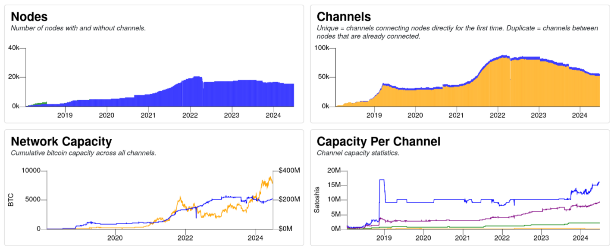

Source: https://bitcoinvisuals.com/lightning

---

### User experience of lightning network (or crypto currency in general)

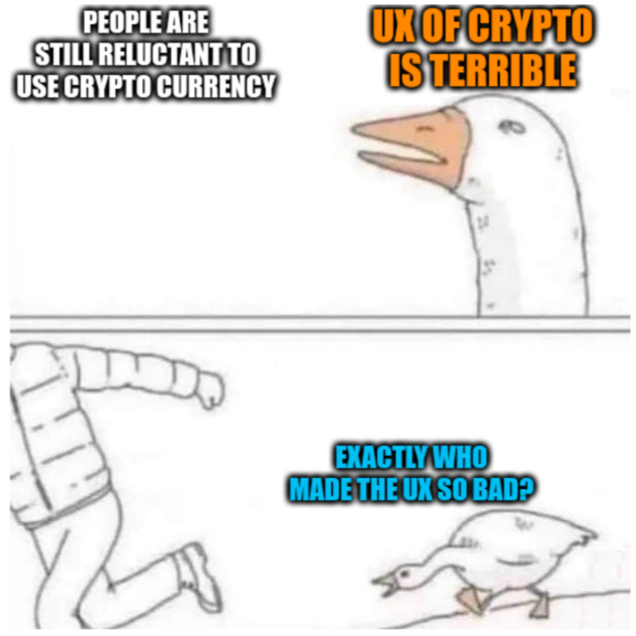

---

## Rethinking lightning

Source: https://stacker.news/items/379225

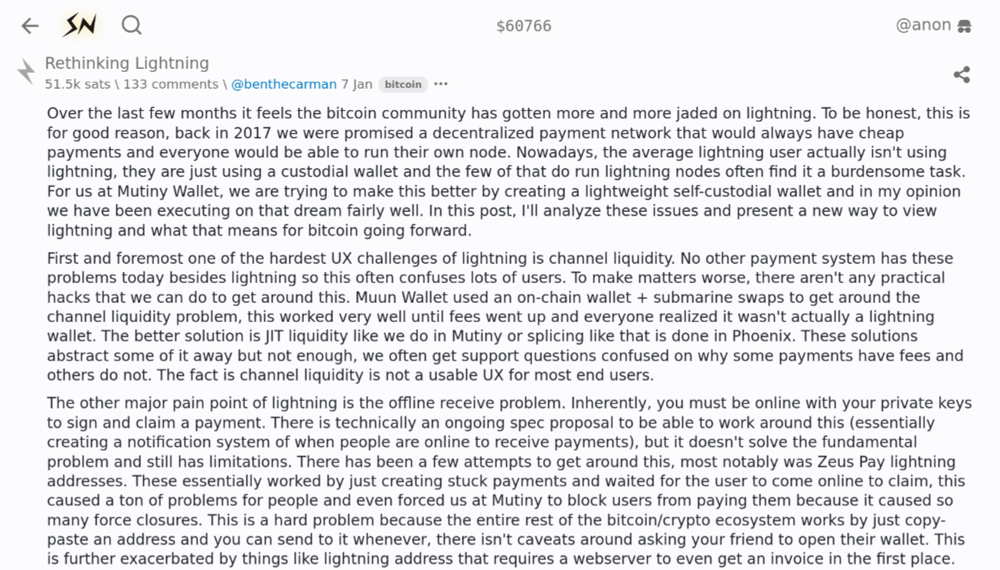

---

> Nowadays, the average lightning user actually isn't using lightning.

> First and foremost one of the hardest UX challenges of lightning is channel liquidity.

> The other major pain point of lightning is the offline receive problem.

> Combining existing large scale lightning infrastructure with self-custodial solutions sadly, isn't totally possible.

> So how do we scale ownership? Simply put, the answer today is custody.

---

> Are we doomed then? Is there no way to scale bitcoin in a self-sovereign way? Luckily, the answer is no, but we need some soft-forks. Covenants are the way to scale bitcoin ownership.

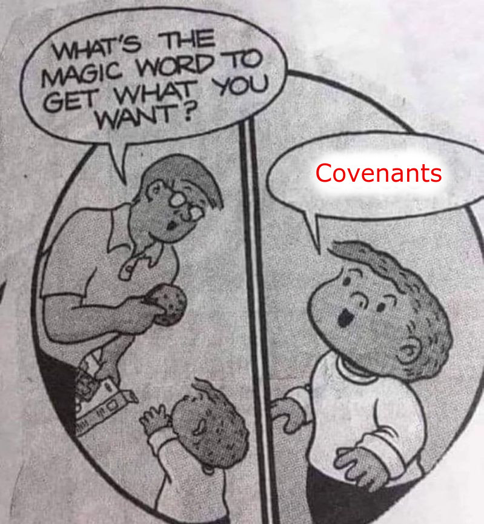

---

### What covenants can do?

Source: https://covenants.info/overview/summary/

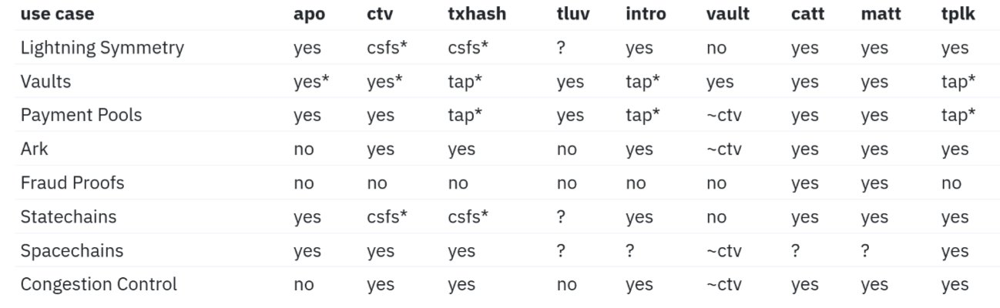


---

### When can we use covenants on BTC?

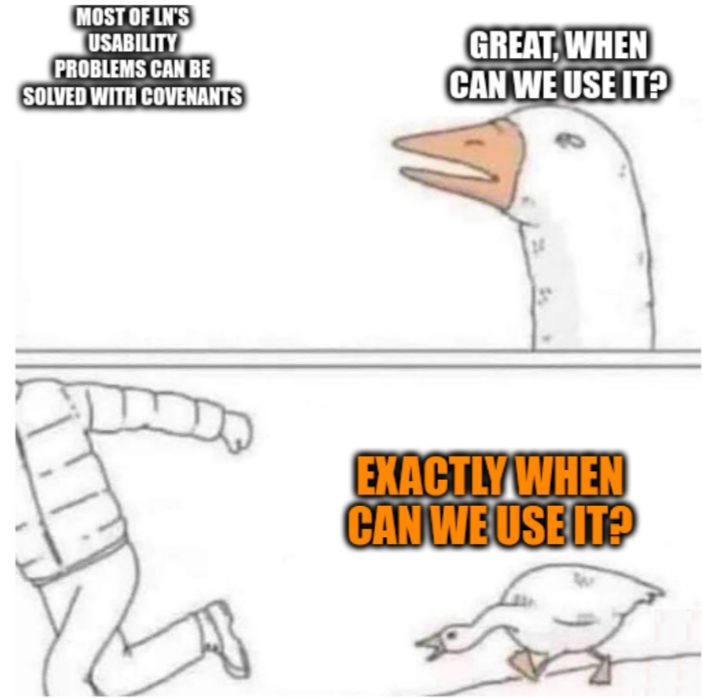

---

## Join BTC by CKB


---

## Wait, does CKB have covenants already?

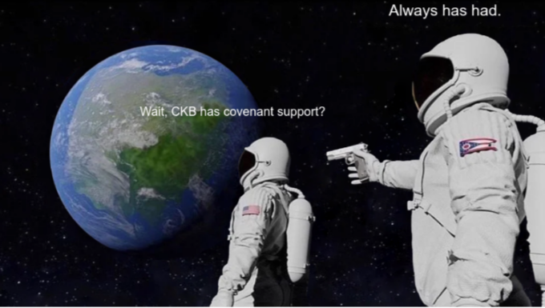

---

They have always been there. Just too trivial to give a dedicated term.

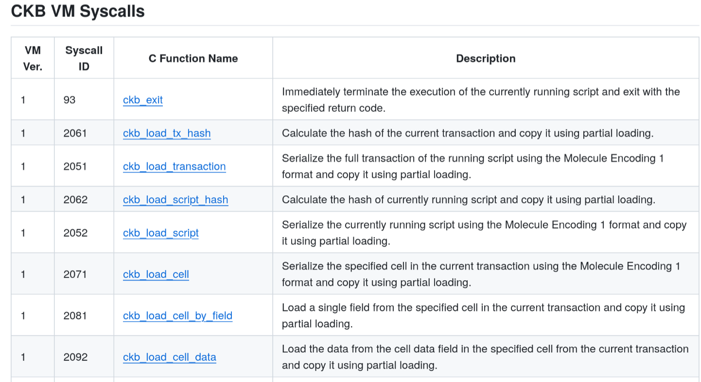

---

### And can CKB do that?

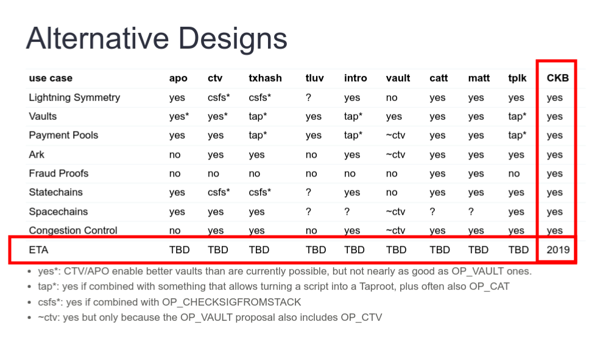

---

### Request for fact-checking

- You are welcome fact-check my hasty conclusion above (it's backed by only over-confidence). 
- I will not fix any inaccuracy in my slides, as CKB is easily fixable.

---

## Introducing CKB Fiber Network (CFN)

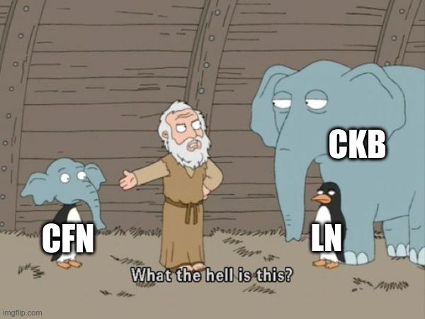

---

```
    BTC      L1
   /   \
  /     \
LN      CKB  L2
  \     /
   \   /
    CFN    L2+L2=L3 or L4?
```

- LN: Instant, Infinitely Scalable P2P Payment System
- CKB: Unmatched Flexibility and Interoperability

Call this $L_\infty$ instead of $L_3$ or $L_4$.

---

### High level overview of CFN

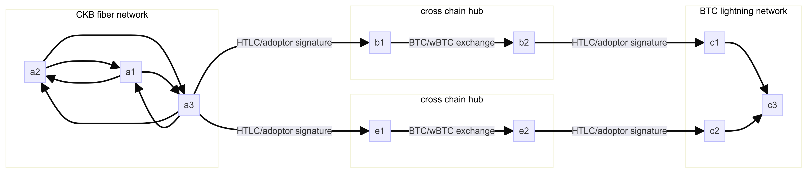

---

- Same building blocks as lightning network (HTLC and revocation)
- Native multiple assets support (extremely versatile thanks to xUDT's extensibility)
- Cross-chain payment channel network (available now, made only possible by CKB-VM's flexibility)

---

## Demo time

Too bad. We only have time to show some staged animations.

You can reproduce the result from https://github.com/nervosnetwork/cfn-node/tree/7580b6b4b7550c0ab1dd69215f63e4f567219917/tests/bruno/e2e/cross-chain-hub (a few config tweaks required).

---

What we did there was

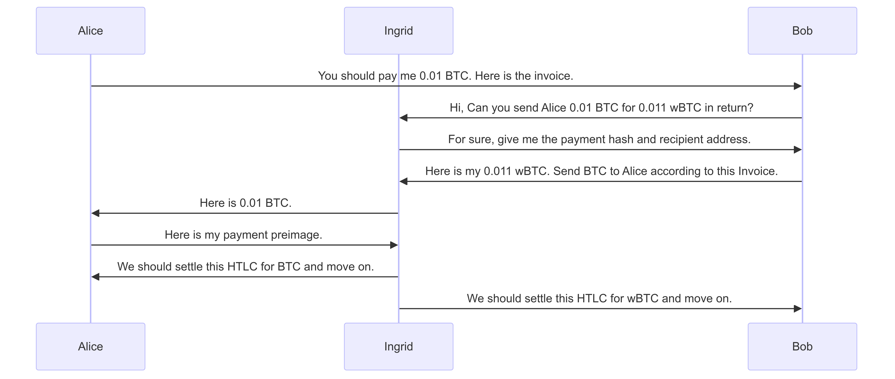

---

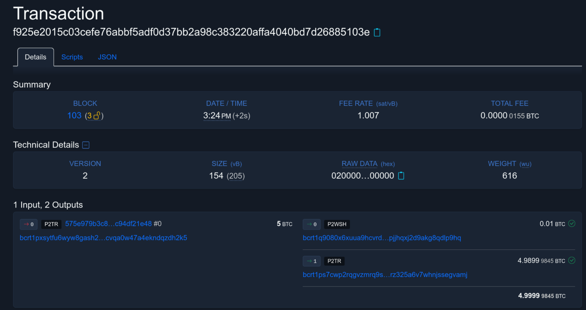

---

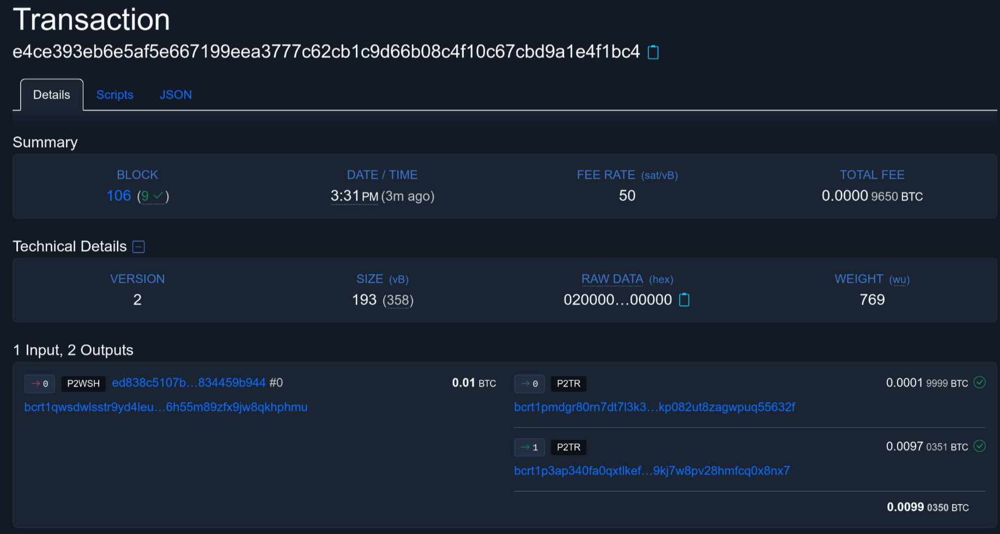

---

## Conclusion

---

### CFN as of today

- Same security assumption as bitcoin lightning network
- Native multi-assets payment channel network
- Referenece implementation (https://github.com/nervosnetwork/cfn-node/) is now available with BTC cross chain support (WARNING: demonstratable only for now, lots for bugs to be squashed)
- Almost all the functionalities mentioned above have their respective RPC (https://github.com/nervosnetwork/cfn-node/blob/main/src/rpc/README.md) ready for integration

---

### You are wanted


---

### CFN as of tomorrow

- Achieve feature parity with bitcoin lightning network (watch tower, multiple-hop network)
- Rethink payment channel network with CKB's extensibility and programmbility
  - State channels with smart contract support
  - Highly-articipated lightning network features made possible by covenants (e.g. Non Interactive Channels)
  - And beyond

---

## Join the force

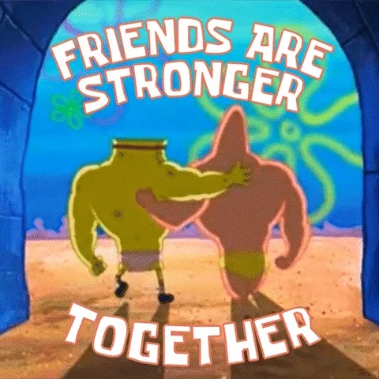

Come and build.
Life is too short
for all the nicest BIPs to land.

- https://github.com/nervosnetwork/cfn-node
- https://github.com/nervosnetwork/cfn-scripts